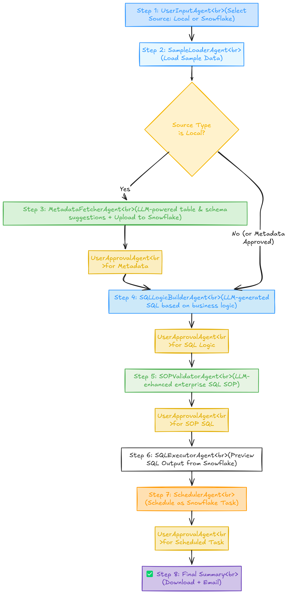

# 🏢 Enterprise ETL Studio

ETL workflow orchestrator with Snowflake, SQL generation, agent-based automation, and UI-based approvals.

## 📊 Workflow Overview

## 🔧 Features
- Local or Snowflake input
- LLM-powered SQL generation
- Enterprise SOP SQL enhancement
- Task scheduling in Snowflake
- Email export, CSV uploader, and more
